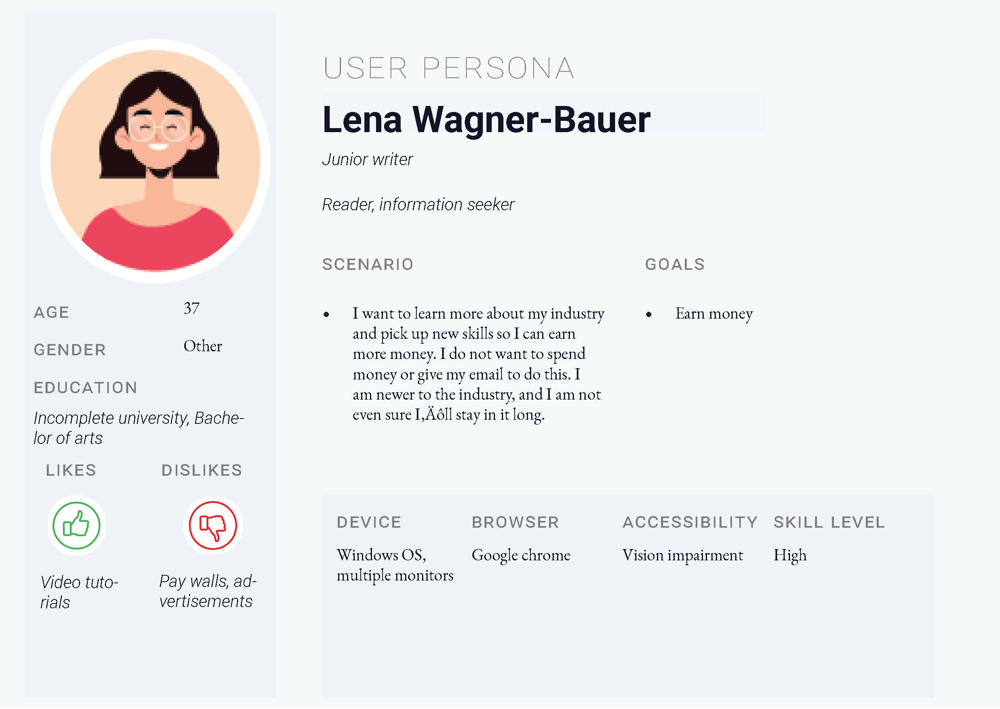
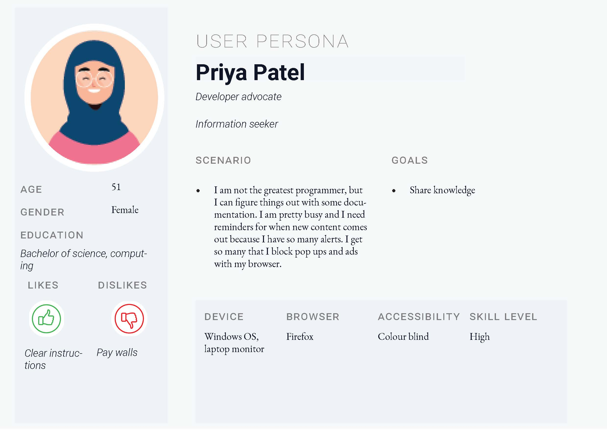
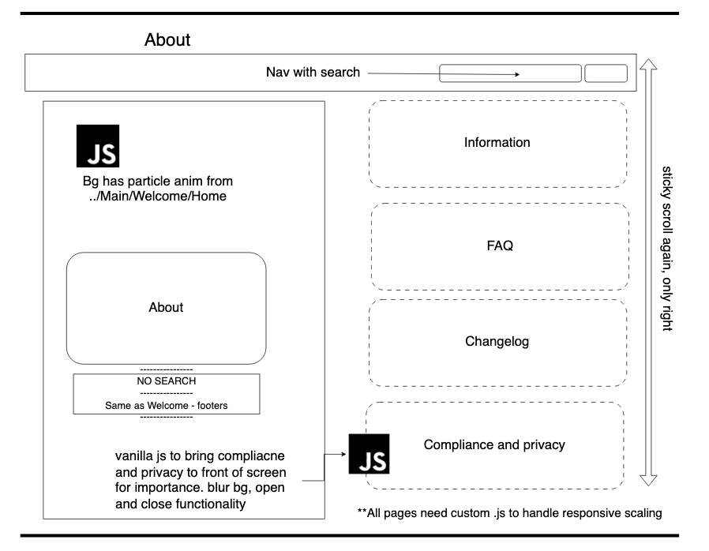

.. submitted already to AU for assessment, file locked 25 MAY 2024

Unit 1 site design learning diary
+++++++++++++++++++++++++++++++++++

.. _unit1-ref:

Summary
========

    *"I took my time to complete this unit because I knew that if I made purposeful decisions, they would connect together when completing the coding in the later units. I disregarded style sheets and visual design, leaving my mock up to be a very bare metal with an emphasis on the sitemap, carefully engineered to my personas and their scenarios."*

The work
==========
.. describe briefly what you have done as work for that unit.

1. Visit `AU course book <https://scis.lms.athabascau.ca/mod/book/view.php?id=13059>`_ > **print book** as .pdf for offline reading.

2. Read the 19 instruction pages.

    .. Note::
       The Unit 1 reading markup is provided as an attachment under **References**.

3. Prepare the design documentation.

   - Theme and purpose
   - Personas
   - Scenarios
   - Further requirements
   - Mockup
   - Site map
   - Learning diary

4. Upload the documentation to GitHub and submit a learning diary post as a blog entry in the **Group Blog**.

5. Notify the tutor of the submission, and upload to the **AU drop box**.

Assignment 1 submission
========================
.. describe the rationale for what you have done, relating your work explicitly to the personas and scenarios you developed in Unit 1.

Theme and purpose
------------------

   *A website for technical publication specialists. The website showcases free tools that can be used in a variety of workflows. Users of all skill levels can use this accessible website to automate processes, learn, or get inspiration to write their own CRUD tools. The website is inspired by the authors experience working in the industry, and a desire to innovate.*

I chose a site that I am passionate about; building CRUD tools for an industry I am already working in. I think this is useful because it helps others who don't have the time to dig into the *hours* of debugging required to write some of these tools, or those who may not have the programming background to do it themselves. 

I want to make sure my site serves three points:

1. It should appeal to an audience with a wide skill, industry, and age range.
2. It should be accessible, with limited barriers.
3. It should be primarily focused on publication, but dynamically demonstrate the tools.

My audience is a pool of 27,000+ technical writers, editors, copywriters, product managers, knowledgebase specialists, developer advocates, solutions architects, and really anyone involved in data, scientific, product, or knowledge publications. They are collected in subreddits and communities that I belong to. 

There is a growing number of these professionals who are currently being trapped by outdated learning resources hidden behind a pay wall.

   *My goal is to provide knowledge and valuable upskilling for free, while demonstrating how a technical writer could 10x productivity.*
   

The scope for this build is realistic and well thought. I have a variety of tools that I've created, but I lack the front-end and javascript know-how to present them in a captivating way. I am passionate to discover how to leverage javascript and connect with rich libraries:

+ `chart.js <https://www.chartjs.org/>`_
+ `d3.js <https://d3js.org/>`_
+ `three.js <https://threejs.org/>`_

With these ideas, I can keep my site focused primarily on publication through the documentation of my tools, while doing it in a dynamic way with forms, actions, animations, conversions, sorts, multimedia control, and more.

Personas and scenarios
------------------------
I made sure to prepare a future-proof way of managing my personas, which are important because they dictate a lot of the compliant code I will need to write to make the site responsive and compliant with AODA requirements for accessibility.

I used a :download:`.csv for the data <../attachments/personaData.csv>`, and an :download:`.indd file for the publishing <../attachments/personaMain.indd>` template. Since I know that this can change in future, I want to make sure I have an easy way to edit the source data and re-publish the .pdf's quickly. The way I have designed this has automated this process for me, since the template accepts the persona data as variables, managed from the .csv.

Read my personas **with their scenarios** `here <https://github.com/hectorbarquero/university-COMP266/tree/main/attachments/personas>`_

   

Further requirements
---------------------
I considered a few legal obligations and browsed similar products to determine I need the following:

+ Accessibility compliance statement
+ Canadian consumer protection laws
+ Anti spam
+ Open source license declaration
+ Security declaration for trust
+ Third-party software acknowledgement
+ Respect for third-party licenses
+ Privacy and data protection notices
+ Warnings to remove liability for potential data
+ System corruption when running any of the tools
+ Notifications and consent

Source more information about these Canadian e-Commerce requirements `on this web page <https://sbs-spe.feddevontario.canada.ca/en/e-business-security-privacy-and-legal-requirements>`_.

Mock up and site map
---------------------
My site map is available here as both `.xml <https://github.com/hectorbarquero/university-COMP266/blob/main/attachments/siteMap.drawio>`_ and a `.png <https://github.com/hectorbarquero/university-COMP266/blob/main/images/COMP266sitemap.png>`_. 

It contains:

+ The typical user journey
+ The navigation choices
+ Pages within the navigation choices
+ The connections between some, where an excerpt exists
+ The external flows to other technologies powering some of the features, which the AU server can't power reliably

.. image:: ../images/COMP266sitemap.png
   :alt: Site map of my project.

To see it all connected, check out my mock up. You can also `view these on my GitHub <https://github.com/hectorbarquero/university-COMP266/tree/main/images/mockup>`_ to view them individually.

.. image:: ../images/mockup/COMP266welcome.png
   :alt: Mock up of the initial welcome pages

.. image:: ../images/mockup/COMP266news-showcase.png
   :alt: Mock up of the news and showcase reel

The learning map
=================
.. for each learning outcome for the unit, explain how you have met it, with reference to the content that you produce (typically your code or other design artifacts).

Use this section to map my learning with the expected outcomes. This section is for the assessors who are grading my work.

Expected outcomes for Unit 1
-----------------------------
1. Identify the potential audience and purpose for a website.
2. Use a simple but structured process to identify how the website will address the needs of the anticipated audience.

My mapped learning
-------------------

.. Tip::
   AU evaluators use this rubric to grade assignments. To comment, open the build menu, titled **v: latest** > select .pdf to > comment on a local pdf reader.

.. csv-table:: Template for mapping your activities to learning outcomes
   :file: ../attachments/learningTemplate1.csv
   :widths: 45, 35, 10, 10
   :header-rows: 1

What went right and wrong
==========================
.. describe what you would do differently if you had to do it again.

   I am happy with the the work I did. If I were to do it again, not a lot would be done differently. 

One issue that was plaguing me was the .pdf builder for my project. In short, there is no cache busting on my server. To temporarily fix this, I give the DNS cache approximately 24 hours to resolve CDN issues itself. I withheld .pdf submissions from my learning diary posts on the AU landing, and leave those .pdf submissions for the drop-box instead.

The simplest way to submit assignments would be to use a standard text editor and generate a .pdf with the built-in .pdf exporter engine. 

I opted to use a different solution, especially for my personas, because the imminent future maintainability of this project is on my mind. The instructions noted that we should choose something that we're passionate about, and something that we could see ourselves working on for months or years.

In those months and years, I think my complicated debugging will feel nominal for the value added gain of ease of maintenance. 

Related topics
================
.. link related reading or topics

+ :ref:`Unit 0 learning diary <unit0-ref>`

Additional reading
===================

+ :download:`COMP 266 - Unit 1 orientation notes <../attachments/readings/unit1Reading.pdf>`
+ `Hectors project GitHub <https://github.com/hectorbarquero/university-COMP266>`_

Get in touch
=============

I don't check my emails often. Connect with me on `LinkedIn <https://www.linkedin.com/in/hectorbarquero>`_, or see what I'm up to on `GitHub <https://github.com/hectorbarquero>`_.

