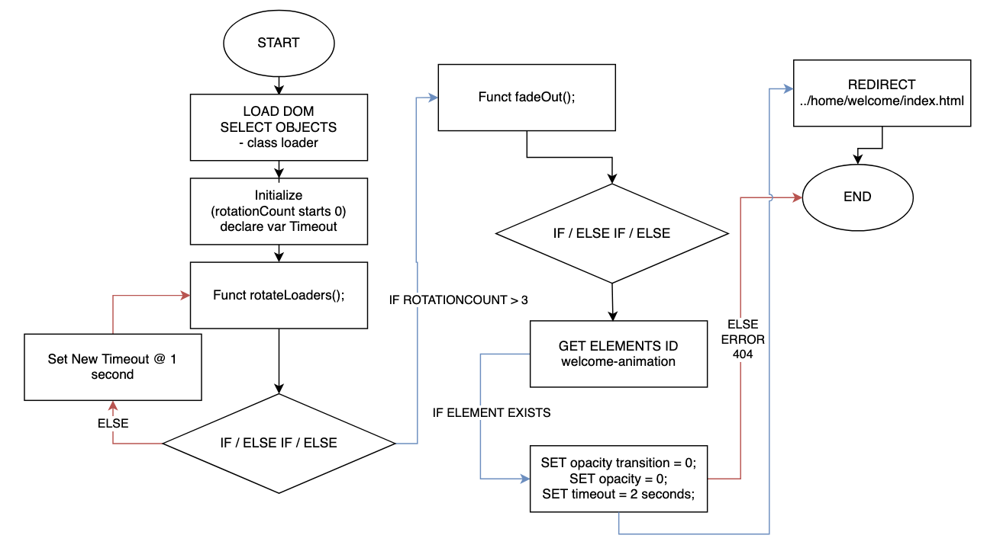
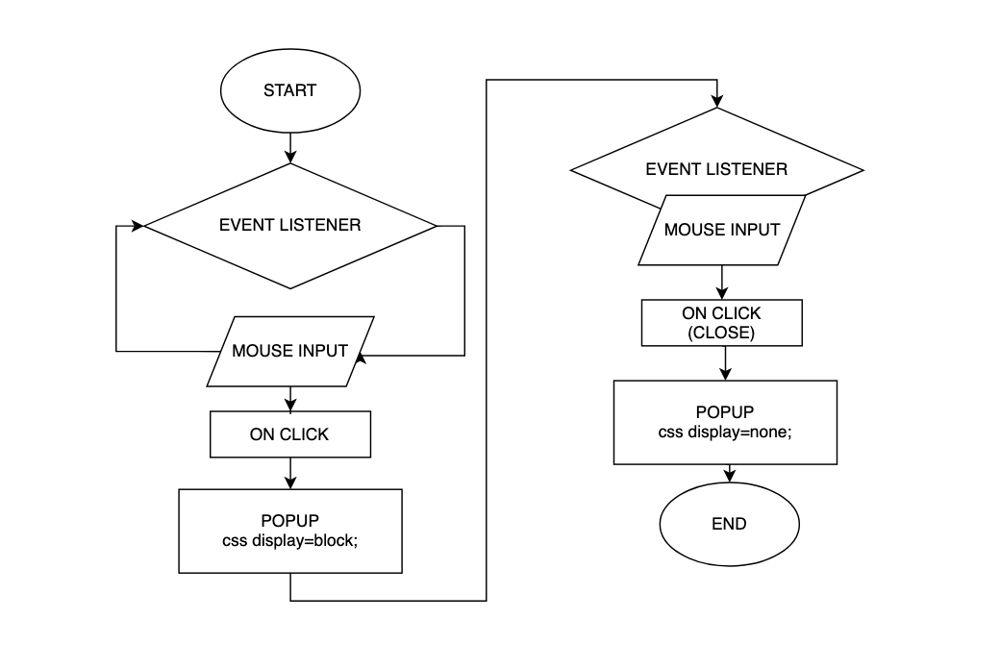
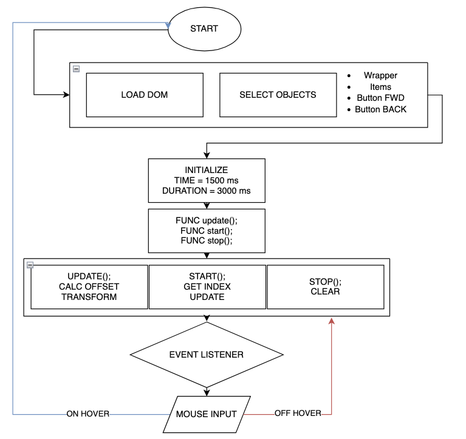
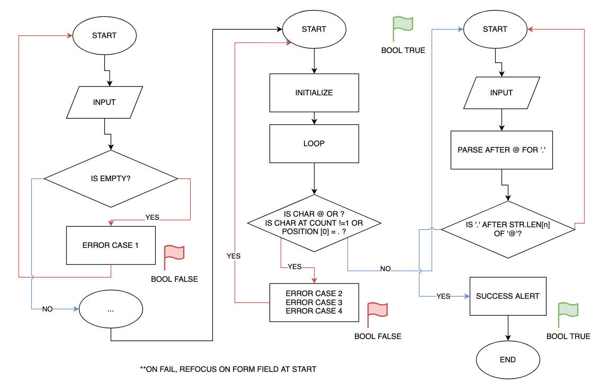

.. Submitted 08 SEP 2024 - waiting reply for go ahead to code. 
.. Working ahead on unit 6 and 7 in the meantime.

Writing javascript
+++++++++++++++++++

.. _unit5-ref:

.. Tip::
   `Download my Unit 5 source by following this link <https://drive.google.com/file/d/1pmzY5laetKPVjrrJgpbV1bEZV7BWqyAJ/view?usp=drive_link>`_. Unpack the .zip and view the README.txt to learn more about the file structure. `You can also check out my project on GitHub <https://github.com/hectorbarquero/technicalwriting_sandbox>`_

Summary
========

   *"Having to catch bugs after compiling at run time gave me PTSD, but I came out of Unit 5 understanding the time and place for Javascript"*

The work
==========
.. DONE

1. Visit `AU course book <https://scis.lms.athabascau.ca/mod/book/view.php?id=13067>`_ > **print book** as .pdf for offline reading.

2. Read the 25 instruction pages.

    .. Note::
       The Unit 5 reading markup is provided as an attachment under **References**.

3. Based on your personas and scenarios developed for Unit 1, in your learning diary, identify ways that JavaScript elements might improve your site.

4. Design a logical process model.
   
    .. Warning::
       Submit the proposal to the tutor and get approval before coding it.

5. Code it.
   

6. Upload the docs to GitHub and submit a learning diary post as a blog entry in the **Group Blog**.

Assignment 5 submission
========================
.. DONE - APPROVED ON 10 SEP 2024

Javascript ideas
------------------

I plan to write some javascript programs to do the following:

Javascript website loader (hydration, pre-fetching)
~~~~~~~~~~~~~~~~~~~~~~~~~~~~~~~~~~~~~~~~~~~~~~~~~~~~

a loader, which acts as a make-shift means to do hydration and resource pre-fetching, so that there is less risk of jank and layout shifts, and reduce the risk of immediate redirects since I'll be hosting this website on GitHub and negating additional security for the meantime. 

.. add image for loader

Javascript popup handler
~~~~~~~~~~~~~~~~~~~~~~~~~

a popup handler, which directly correlates with some of my user personas distaste for bloated reading and advertisements. I'll be able to use just one means to present the required legal notices, rather than force the browser to load it.

.. add image for popup handler

Javascript transition handler
~~~~~~~~~~~~~~~~~~~~~~~~~~~~~~~

a slide handler (called testimonials), which will allow me to aesthetically present the testimonials to suit the needs of my personas. My personas dislike nested content and appreciate less text, opting for more visible means of presentation. This slideshow handler will allow me to negate the need to scroll, and will allow the testimonials to present in a more visually pleasing way.

.. add image for slide handler

   

Javascript input validation handler
~~~~~~~~~~~~~~~~~~~~~~~~~~~~~~~~~~~~~

input validation, which helps make sure that the input entered into the form fields is sanitized. This is important since I'll want to make sure that I have the bare minimum means to protect against cross site scripting attacks, injection, or 1=1 attacks. I found this program in unit 4 and credited the programmer, but I've made some modifications for brevity.

.. add image for input validation

In unit 6, I plan to use particles.js to write a program that enhances the visual experience of my website to suit the need of a persona.

In unit 7, I plan to write two additional programs that satisfy the requirements of unit 7 and enhance the experience for my users per their personas. I will write a widget that toggles the view from web (large) to mobile (or small laptop/tablot), and I will write a program that allows my users to share news or posts to their social media with third party social media API's.

Expected outcomes for Unit 5
-----------------------------
+ write well-structured, easily maintained JavaScript code following accepted good practice, including
     - general appearance and form: well-commented, properly laid out, appropriate capitalization.
     - structure: modular, using functions, classes and objects effectively, making effective use of variables.
     - standards-compliant: avoiding proprietary elements where possible and working with the vast majority of web browsers.
     - accessible: usable in some form by people with a wide range of disabilities or, if not, failing gracefully and offering alternatives to achieve similar functionality.

+ make effective and efficient use of a full range of programming constructs including sequence, selection and iteration.
+ effectively use variables, including passed parameters, local and global variables and arrays, to improve the efficiency, re-use, and maintainability of the code.
+ use a wide range of programming features and commands to improve the efficiency, re-use and maintainability of the code.
+ write JavaScript code that works in all major browsers (including IE, Mozilla-based browsers such as Firefox, Opera, Konqueror, Safari, Chrome).
+ effectively debug JavaScript code, making use of good practice and debugging tools.

What went right and wrong
==========================

I spent a fair amount of time reading documentation. I went back to my college courses and re-wrote the programs I did back then as Javascript solutions, which helped learn quickly. What went wrong was mostly the debugging. Javascript has a lot of weird quirks. I can load different data types into arrays, it doesn't care about floats or doubles as types, null is technically an object, javascript doesn't *really* care about semicolons, it uses template literals-- which I'm not used to, and it isn't statically typed-- that's the big one that got me. The list goes on and on, but I'll keep this short.

Having to catch bugs *after* compiling at run time gave me PTSD. 

On the positive side, I can see myself using Javascript as a fast scripting language. What went right was that I came out of Unit 5 understanding the time and place for Javascript, especially because the programs I had practiced with were the same but used two different langauges. For big programs, especially where logarithms and order of magnitude are important, I'll need to use another language. I guess that's why Javascript modules are so small.

When I need a fast, on-the-fly, throwaway-code, small, dynamic solution... I'll opt for Javascript. Another workaround is Typescript, apparently, or using frameworks for complex tasks... But I haven't gotten into that yet. Maybe unit 6.

Additional reading
===================

+ :download:`COMP 266 - Unit 5 orientation notes <../attachments/readings/unit5Reading.pdf>`
+ `Learning diary <https://github.com/hectorbarquero/university-COMP266>`_
+ `Project website <https://github.com/hectorbarquero/portfolio>`_
+ :ref:`Unit 0 learning diary <unit0-ref>`
+ :ref:`Unit 1 learning diary <unit1-ref>`
+ :ref:`Unit 2 learning diary <unit2-ref>`
+ :ref:`Unit 3 learning diary <unit3-ref>`
+ :ref:`Unit 4 learning diary <unit4-ref>`

Get in touch
=============

I don't check my emails often. Connect with me on `LinkedIn <https://www.linkedin.com/in/hectorbarquero>`_, or see what I'm up to on `GitHub <https://github.com/hectorbarquero>`_.