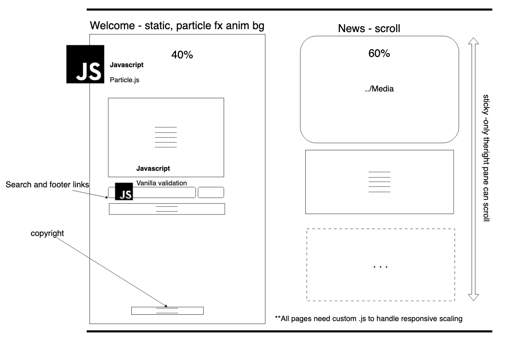

.. Currently working

Using libraries
++++++++++++++++

.. _unit6-ref:

.. Tip::
   `Download my Unit 6 source by following this link <https://drive.google.com/file/d/1Ko6LSdfKu25-DC1OX1-FGQRREAtS0Oc-/view?usp=drive_link>`_. Unpack the .zip and view the README.txt to learn more about the file structure. `You can also check out my project on GitHub <https://github.com/hectorbarquero/technicalwriting_sandbox>`_

Summary
========

   *"I chose particle.js because I wanted to create an interactive and dynamic aesthetic element to my web page, but I did not want to calculate the trigonomotry required for circular animated motion and curve pathing"*

The work
==========
.. DONE

1. Visit `AU course book <https://scis.lms.athabascau.ca/mod/book/view.php?id=13069>`_ > **print book** as .pdf for offline reading.

2. Read the 6 instruction pages.

    .. Note::
       The Unit 6 reading markup is provided as an attachment under **References**.

3. Create a proposal to add dynamic content to your page using a library > submit it to the AU portal.

4. Code it.
   
5. Upload the docs to GitHub and submit a learning diary post as a blog entry in the **Group Blog**.

Assignment 5 submission
========================
.. DONE

Library/framework proposal
----------------------------

This unit will implement the proposed design from Unit 1. 

I'll need a framework to handle the calculations for me, since otherwise, I'll need to re-calculate the curve pathing and trigonometry required to tesselate the animated feature.

The proposed design is below: 

To implement this, I'll follow the `documentation <https://github.com/VincentGarreau/particles.js>`_

As an overview, the process requires that you:

1. Download the package using the node package manager.
2. Load and configure particle.js directly in the HTML:

.. code-block:: 

   

   

3. Call particle.js within app.js, use the JSON as a local config, or use the CDN.

.. code-block:: 

   /* particlesJS.load(@dom-id, @path-json, @callback (optional)); */
   particlesJS.load('particles-js', 'assets/particles.json', function() {
   console.log('callback - particles.js config loaded');
   });

Finally, I can override the required parameters with the listed **Options** in the documentation. I can observe the build and use an inspector to see which .sass parameters I'd like to override in order to get the desired .css for my site.
 

Expected outcomes for Unit 5
-----------------------------
When you have completed this unit, you should be able to use JavaScript libraries (e.g. ,JQuery) to create dynamic pages.

What went right and wrong
==========================

In comparison to earlier units, there was only 6 instruction pages with some missing information. The learning outcomes section was especially light, where normally other unit instruction packages had more bullets to help aim the design towards.

I found the reading to be mostly in documentation for the framework itself. I chose to use particle.js, and not JQuery. When I was reading modern resources about JQuery, I found it is widely considered obsolete now with better native javascript improvements having the features built-in to vanilla js. JQuery adds unecessary weight, and has better front-end alternative frameworks like Vue or Angular. 

I chose particle.js because I wanted to create an interactive and dynamic aesthetic element to my web page, but I did not want to calculate the trigonomotry required for circular animated motion and curve pathing. Particle.js is a framework written by `Vincent Garreau <https://github.com/VincentGarreau/particles.js?tab=readme-ov-file>`_ that creates interactive, lightweight particle systems for web pages.

The implementation of the framework was straight forward, and I opted to move onto unit 7 since I have experience in using frameworks and APIs in my work.

Additional reading
===================

+ :download:`COMP 266 - Unit 6 orientation notes <../attachments/readings/unit6Reading.pdf>`
+ `Learning diary <https://github.com/hectorbarquero/university-COMP266>`_
+ `Project website <https://github.com/hectorbarquero/portfolio>`_
+ :ref:`Unit 0 learning diary <unit0-ref>`
+ :ref:`Unit 1 learning diary <unit1-ref>`
+ :ref:`Unit 2 learning diary <unit2-ref>`
+ :ref:`Unit 3 learning diary <unit3-ref>`
+ :ref:`Unit 4 learning diary <unit4-ref>`
+ :ref:`Unit 5 learning diary <unit5-ref>`

Get in touch
=============

I don't check my emails often. Connect with me on `LinkedIn <https://www.linkedin.com/in/hectorbarquero>`_, or see what I'm up to on `GitHub <https://github.com/hectorbarquero>`_.