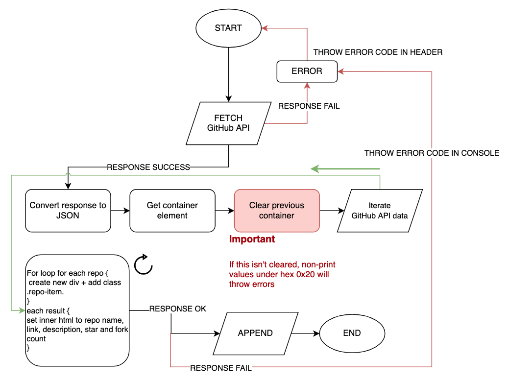

.. Suybmitted on 27 SEP 2024 - done program, waiting for grading and messaged TA and instructor

Using external data sources
+++++++++++++++++++++++++++++
.. ADD package here
.. note::
   This is my final submission, and the course is now complete. I am awaiting grading. Instructors can find my submission package containing source code, rubrics, learning diaries, and documentation here. A short video is recorded to walk you through my submission package, available here.
   

.. _unit7-ref:
.. Tip::
   Download my Unit 7 source by following this link ``https://drive.google.com/file/d/12O2RyAlRuhhsKwE3wRZDfLo1oaRBjvCw/view?usp=drive_link``. Unpack the .zip and view the README.txt to learn more about the file structure. `You can also check out my project on GitHub <https://github.com/hectorbarquero/technicalwriting_sandbox>`_

Summary
========

   *"There were warnings for this unit about needing a server for the API, but I found that it wasn't required for the API functionality, but instead, I needed a server to hide the API token itself with a server function. For best practice, you should not expose your token. I remedied this issue by creating a server function which hides the token in a proxy, and exposes only the data retrieved by the back-end.*"

The work
==========

1. Visit `AU course book <https://scis.lms.athabascau.ca/mod/book/view.php?id=13071>`_ > **print book** as .pdf for offline reading.

2. Read the 15 instruction pages.

    .. Note::
       The Unit 7 reading markup is provided as an attachment under **References**.

3. Write a proposal explaining what API integration you'd like to do, and submit it to the AU portal.

4. Code it.
   
5. Upload the docs to GitHub and submit a learning diary post as a blog entry in the **Group Blog**.

Assignment 7 submission
========================
.. WORKING

API implementations
--------------------

Tech news API -> NewsAPI.org
~~~~~~~~~~~~~~~~~~~~~~~~~~~~~~
Some of my personas in unit 1 want industry news *alongside* the tools, so I needed an API that can grab curated news links.

After I chose this API, I discovered it requires a private key, and that I don't want to have it revoked if stolen and misused. I ended up needing to create a proxy server, and then a back-end serverless function to hide my key in an environment variable. If I didn't do this, it would have been visible in my code. 

This was complicated, and the most timely component to this unit since I had to watch headers and understand the requests and responses to debug why my CORS was being denied from my server. I ended up spending the bulk of the allocated hours for this unit in building and setting up a server.

.. code-block:: javascript

   // serverless function for hiding NEWS_API_KEY from my calls

   const fetch = require('node-fetch');

   exports.handler = async (event) => {
      const apiKey = process.env.NEWS_API_KEY;

      try {
         // Adding very weird specifications to exclude some odd hate related results, use -china -nazi to exclude
         const response = await fetch(`https://newsapi.org/v2/everything?q="documentation" -china -nazi -kremlin -roman -birds -russian -death -photons -police&apiKey=${apiKey}`);
         
         if (!response.ok) {
            throw new Error('ERROR: Network response timeout');
         }

         const data = await response.json();

         return {
            statusCode: 200,
            headers: {
               'Content-Type': 'application/json',
               // adding this bc it gives domains access to this function - else CORS error
               'Access-Control-Allow-Origin': '*',
               'Access-Control-Allow-Headers': 'Content-Type',
            },
            body: JSON.stringify(data),
         };
      } catch (error) {
         return {
            statusCode: 500,
            headers: {
               'Content-Type': 'application/json',
               // adding this bc it gives domains access to this function - else CORS error
               'Access-Control-Allow-Origin': '*',
               'Access-Control-Allow-Headers': 'Content-Type',
            },
            body: JSON.stringify({ ERROR: error.message }),
         };
      }
   };

The downside to this API is that the source pulls a lot of propaganda, sometimes radical, from various sources. I had to scrub the results and read documentation for exclusive queries. If you inspect my source code, you'll see some of the strange words I needed to exclude in order to refine the results so that they weren't filled with propaganda. 

Github Repositories API -> Github REST API
~~~~~~~~~~~~~~~~~~~~~~~~~~~~~~~~~~~~~~~~~~~~~

Once I figured out the first API implementation, I used the GitHub API and found it much easier. It uses a public key, so there was no need to abstract the key into an environment variable like ``GITHUB_API_KEY``. I am happy with the outcome because I went further into the MDN docs to learn how to use existing .css in the javascript, so that the output seems to populate my tools index.html page automatically while appearing to be the same aesthetic.

This is a huge time saver for me. Now the API takes care of updating my tools releases for me, and all I need to do is take care of my GitHub repo's and projects.

Expected outcomes for Unit 7
-----------------------------
When you have completed this unit, you should be able to use JavaScript to access and use web services for dynamic content (AJAX, JSON, etc.).

What went right and wrong
==========================

This unit was quoted to be an approximate 10 hours. With good documentation, using webhooks, APIs, and libraries seems to take much less time... the bulk of these allocated hours went to having to configure and build a server.

There are warnings in the unit package stating that a server *may* be required for this unit, but it wasn't required to run the API itself.

Instead, I found myself needing to use a server to deploy a server function in order to hide my API token.

For best practice, you should not expose your API token. It's considered bad practice, and can be damaging in sensitive operations. For this program, fortunately it would mean rate limit abuse and API key revocation in the worst circumstance, but I see no value in lazily completing this unit without taking an attempt of hiding my API token.

I'm also worried that if I don't secure the API token with a server function, then it may be revoked without my knowing, and the site will suddenly break.

I remedied this issue by creating a server function which hides the token in a proxy server, and is never exposed to the client. The client only sees the data retrieved by the back-end. The trade-off is a slightly slower latency in computing time, since the order of magnitude increases slightly.

Once I had figured out how to accomplish this once, it was easy to repeat the solution for the other API implentations. I only needed to reference the documentation to know which webhooks were available for me.

Otherwise, this unit went well and the implementation felt familiar to unit 6.

Additional reading
===================

+ :download:`COMP 266 - Unit 7 orientation notes <../attachments/readings/unit6Reading.pdf>`
+ `Learning diary <https://github.com/hectorbarquero/university-COMP266>`_
+ `Project website <https://github.com/hectorbarquero/portfolio>`_
+ :ref:`Unit 0 learning diary <unit0-ref>`
+ :ref:`Unit 1 learning diary <unit1-ref>`
+ :ref:`Unit 2 learning diary <unit2-ref>`
+ :ref:`Unit 3 learning diary <unit3-ref>`
+ :ref:`Unit 4 learning diary <unit4-ref>`
+ :ref:`Unit 5 learning diary <unit5-ref>`
+ :ref:`Unit 6 learning diary <unit6-ref>`

Get in touch
=============

I don't check my emails often. Connect with me on `LinkedIn <https://www.linkedin.com/in/hectorbarquero>`_, or see what I'm up to on `GitHub <https://github.com/hectorbarquero>`_.