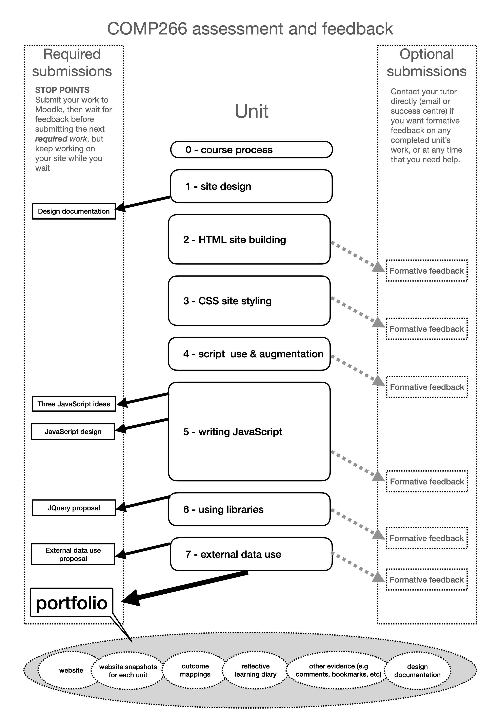

.. COMP266 learning diary documentation master file, created by
   sphinx-quickstart on Mon May 13 10:09:10 2024.
   You can adapt this file completely to your liking, but it should at least
   contain the root `toctree` directive.

.. tip::
   You can use the side bar to navigate to the chapters you're interested in, or the top search bar to navigate directly to content you're looking for.

COMP266 documentation
+++++++++++++++++++++++
Welcome to my COMP 266 project. Here you'll find my learning diary, my reading notes, and useful attachments like my sitemap, personas, and prototypes. You'll also find my source code, which you're free to fork and repurpose.

.. toctree::
   :maxdepth: 4
   :caption: Unit 0
   :hidden:

   Unit 0/learningDiary.rst

.. toctree::
   :maxdepth: 4
   :caption: Unit 1
   :hidden:

   Unit 1/learningDiary.rst